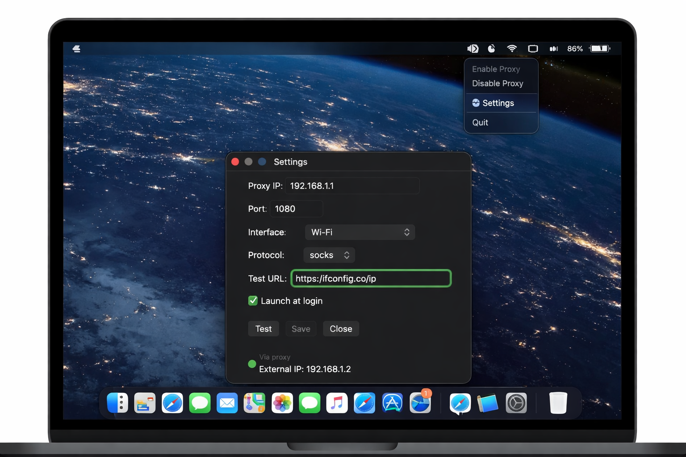

# ProxyAssistant

Minimal macOS menu bar utility for enabling and disabling system proxy (HTTP / HTTPS / SOCKS) with one click.

Designed as a lightweight tool for developers and advanced users who frequently switch proxy configurations.


---

## ✨ Features

- Toggle system proxy directly from the macOS menu bar
- Supports **HTTP**, **HTTPS**, and **SOCKS**
- Per-interface configuration (Wi-Fi, Ethernet, etc.)
- Direct vs proxy-aware connectivity testing
- Custom test URL support (default: `https://ifconfig.co/ip`)
- Launch at login support
- Live menu bar status indicator
- Automatic proxy state refresh
- No external dependencies

---

## 🛠 How It Works

ProxyAssistant modifies system proxy settings using the built-in macOS utility:

```
/usr/sbin/networksetup
```

The app:

- Detects current proxy state
- Enables/disables proxy per selected interface
- Tests connectivity:
  - **Direct mode** if proxy is disabled
  - **Via proxy mode** if proxy is enabled

---

## 📦 Requirements

- macOS 13 or newer
- No Apple Developer Program subscription required
- Designed for local usage (not notarized for App Store distribution)

---

## 🚀 Installation

### Option 1 – Build from Source

1. Clone the repository
2. Open `ProxyAssistant.xcodeproj` in Xcode
3. Build in **Release** mode
4. Copy `ProxyAssistant.app` to:

```
/Applications
```

If macOS blocks the application:

- Right-click → **Open**

or remove quarantine attribute:

```bash
xattr -dr com.apple.quarantine /Applications/ProxyAssistant.app
```

---

## 🧭 Usage

1. Open **Settings**
2. Configure proxy parameters (IP, port, protocol, interface)
3. Click **Save**
4. Use the menu bar icon to enable or disable proxy
5. Click **Test** to verify connectivity

### Menu Bar Icons

| State | Icon |
|-------|------|
| Proxy disabled | `network` |
| Proxy enabled | `network.badge.shield.half.filled` |

---

## 🔒 Security Notes

- The app modifies system proxy settings only.
- No background daemons.
- No analytics.
- No telemetry.
- No external network calls except the user-configured test URL.

---

## 📄 License

Apache License
